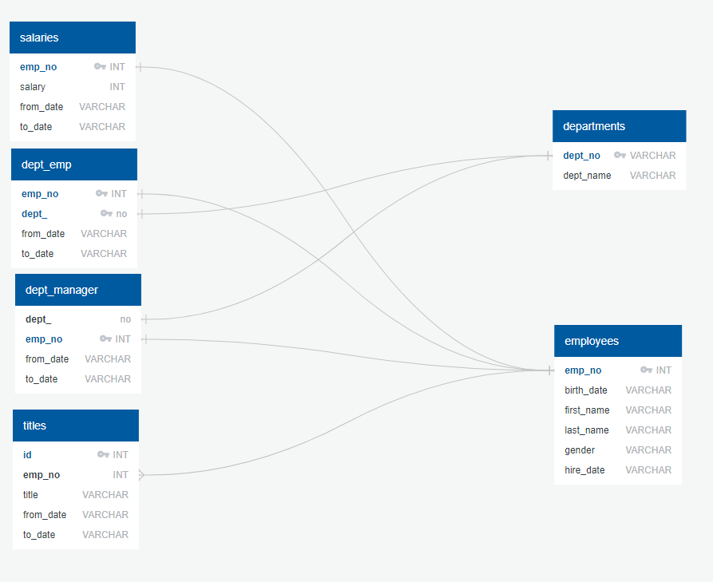

# Assignment 6 - SQL Challenge

## Background

Databases! A vital tool required for datascience, and as such I spent quite a bit of time trying to understand the basics of SQL.

The first step of this challenge was to use PostgreSQL to create a database which contains 6 tables all related to employee and department information.

An ERD was produced to sketch out the tables before hand to understand how the tables would look like including the primary keys, foreign keys, and other contraints.

Once the data was filled into the tables, a bunch of SQL queries were performed to make sure all these topics were covered:

* filters
* updates
* deletions
* joins
* subqueries

Additionally as a bonus, sqlalchemy was used in a jupyter notebook to access the data from this database and create a few visualizations.

### Copyright

Trilogy Education Services © 2019. All Rights Reserved.

