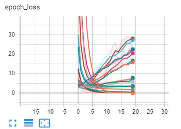
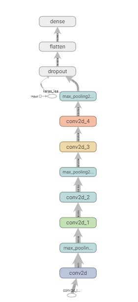
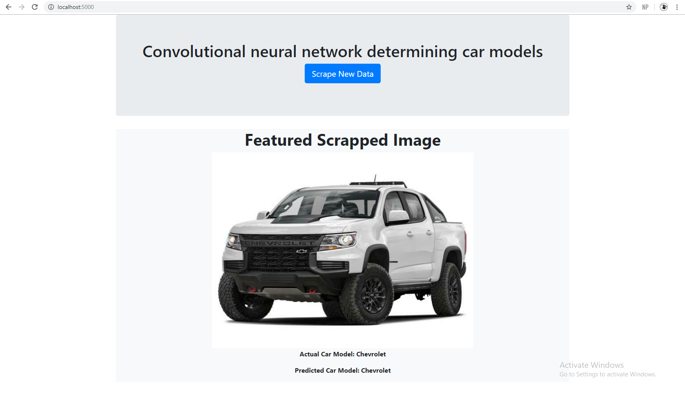

# Data Analytics Bootcamp Project 3

## Background

This last portion of bootcamp was very interesting and exciting to learn. We had just finished learning how to apply different regression and classification models to make predictions with the scikitlearn and keras libraries. The most exciting part of this project was taking all the skills we had learned throughout the bootcamp, and producing an end to end project that incorporates machine learning.

The focus of our project was to produce a model which is able to take an input image of a car, and output the identified/predicted brand of the car. Our group implemented a convolutional neural network to handle the image classification. As we had not been introduced to CNNs during the course, my group had to study, learn and read from multiple different sources to understand how to best implement our model and handle different hyper parameters.

After producing a workable model, we were able to apply the model to different scenarios. For example our model was applied to video detection using the opencv library, and also images were webscraped from kijiji and fed to the model to predict the brand of the cars.

### Data Retrieval

Our dataset was taken from [Kaggle](https://www.kaggle.com/prondeau/the-car-connection-picture-dataset?select=Acura_ILX_2013_28_16_110_15_4_70_55_179_39_FWD_5_4_4dr_aWg.jpg) which contains 60,000+ images from 42 different car brands. 

### Model Building

* The first step in creating our model was to load all the images and formatting each picture so that they can be inputted into the model

* Using opencv we were able to load all of our images in grayscale as a numpy array. After loading the images they were all resized to a generic height and width and the shape of the numpy array holding all the images was reshaped to fit the CNN criteria

* The car brands of each image was contained at the start of each image file name, and this was used to apply a label to each picture. Using sklearn and keras each label (e.g. Honda, Toyota) was converted first into a number, and eventually one-hot encoded which will help the CNN in classification. The label encoder object was saved using the joblib library which we could load in another python script/notebook in the future to get the associating car brand from the number prediction produced by our model

* The image datasets was split into train and test sets, and further split to include a validation set

* After all the images were correctly formatted, several parameters were set to test models of different parameters. (0-2 dense layers, 32-128 filters, and 1-3 convolutional layers)

* Using a nested for loop, each permutation of the parameters set above was applied to a model and the logs for accuracy were logged using tensorboard 

* After applying multiple different parameters, our group looked at the tensorboard logs to look for a trend between parameters and model accuracy. From our tensorboard logs we determined that our trend was accuracy was increasing with more convolutional layers, more filters, however 0 dense layers seemed optimal for our problem

* Because we were training this model locally on my machine (16GB Ram, Nvidia GTX 1060) we had to limit our parameters because of memory restraints and also our project timeline was only 2 weeks. With these factors in mind we decided on the following CNN structure

### Model Accuracy and Scope Redefinition

* Our model accuracy for predicting car brand from 42 different categories was 55%. Because of this low accuracy we decided to narrow our scope and train a model that could produce higher accuracy

* We decided to take two different looking cars (Mazda and Jeep) and apply a model structure to train this model for a high accuracy prediction

### Video Detection

Using opencv we were able to have a webcam feed constant images to our model to produce a prediction. Images of cars were flashed to the webcam and the model was able to accurately predict the car brands of certain images

### Kijiji webscrape

* Our webscraping python script uses selenium to go through kijiji car listings and retrieve the images from each posting

* This functionality was paired with a flask app to visualize the webscraping process and model classification in a web app

### Conclusions

This was the most intriguing and enjoyable project during the course, and I hope to eventually improve this model and possibly change the functionality/application of this model to apply to a more real-world problem. One piece of functionality we did not achieve but aspired to implement was to have a flask app page that a user can upload an image of a car which can be sent to the model and output a prediction. We were very close to finishing this functionality and this project will be updated with the finished implementation as soon as possible!

### Group Members

This project was completed by [Rimsha Aziz](https://github.com/rimsha-aziz), [Shreya Sachdev](https://github.com/shreyasachdev), [Andrew Maximos](https://github.com/NitrogenHamster?tab=overview&from=2020-06-01&to=2020-06-30), and myself!
