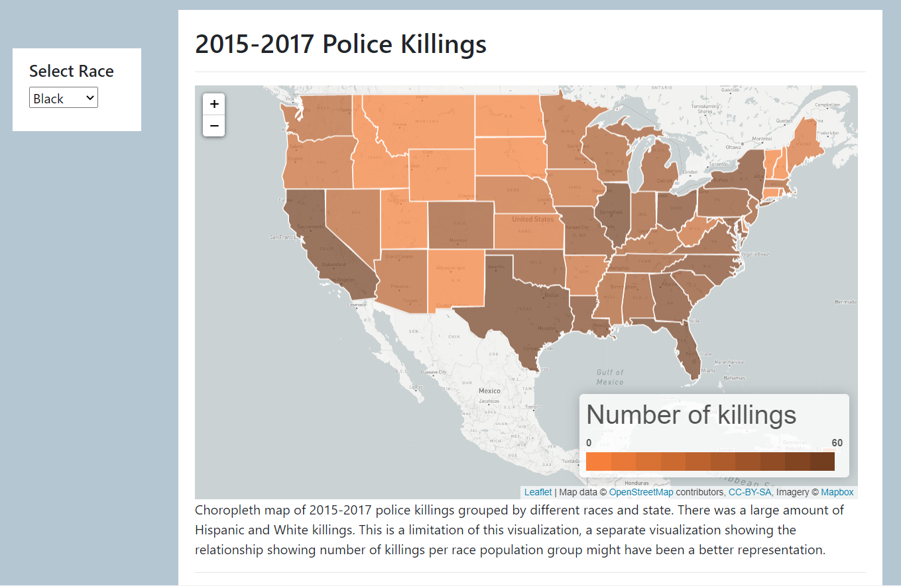
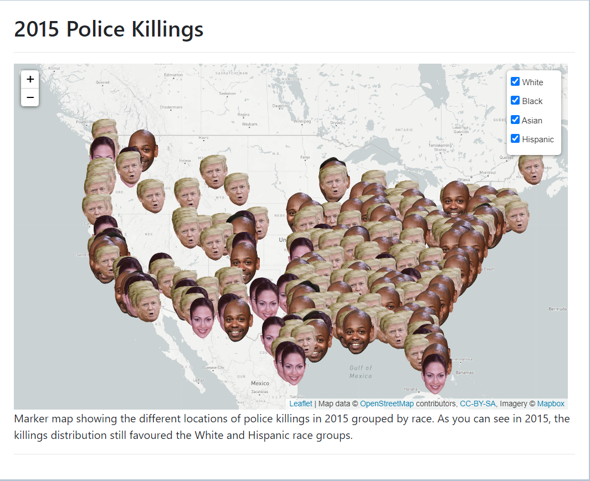
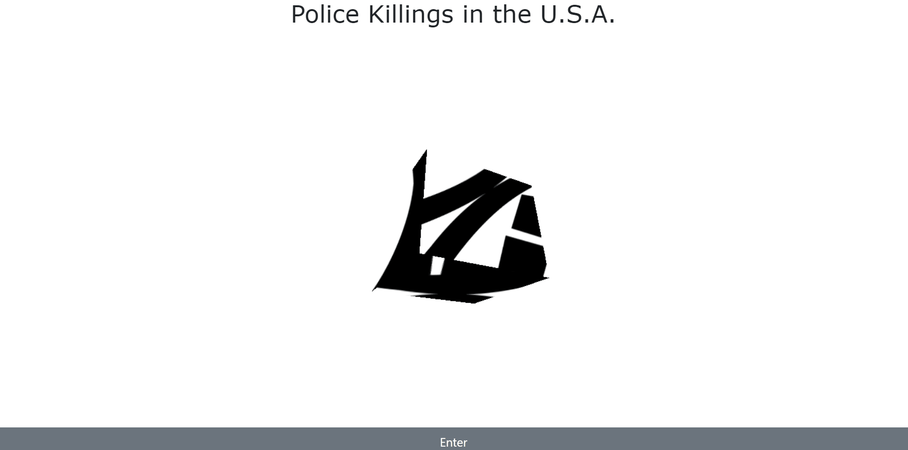

# Data Analytics Bootcamp Project 2

## Background

This project was completed after learning javascript for the first time, including some libraries/tools such as leaflet, d3, bootstrap, and this project also required the group to implement one new javascript library into the project. For my groups case we chose to use the three javascript library to include an animation on our webpage.

At the time this project was completed, the news was heavily populated with the news of police brutality. As a result our group decided to create a police brutality dashboard to have visualizations related to police brutality. Our focus was to visualize police brutality data grouped into race categories to possibly provide insight into trends that may be present. Additional variables being recorded with the data is if the victims were armed/unarmed, and the locations of these incidents.

Viewable on - http://police-brutality.herokuapp.com/

### Data Retrieval/Cleaning

Two sources for data were used in this project, both retrieved from kaggle. Two datasets were used because we had 4 group members and 2 of our members (myself included) wanted to go through the end to end process of finding a dataset, cleaning it, and loading it into a database

* The first dataset was taken from https://www.kaggle.com/washingtonpost/police-shootings, which is based upon the washington post's police killings database. This dataset was loaded into a pandas dataframe and filtered for the necessary columns needed (race, date, city, state, state names, armed). The formatting for the dates, and values for the race/ethnicites were changed to be more reprsentative of the data (e.g the races were labelled as W,B,A,H, which was changed to White, Black, Asian, and Hispanic)

* The second dataset we used was also taken from kaggle, however the link to that dataset seems to be deleted. This dataset was based upon the guardian's police killings database. This dataset was also filtered in pandas using the same techniques listed above

* After collecting and cleaning these datasets, they were imported into a sqlite database using SQLalchemy

### Flask app

The next step was to create the flask app which would serve up our webpages and also contain routes for the police data contained within our database.

* Using SQLalchemy we loaded our database into our flask app and referenced the already existing table structure as models for our 2015-2017 and 2015 datasets

* We planned on having a few visualizations, and we eventually ended up with a choropleth map, a markers map, and a few pie charts. An intro route, and 3 seperate visualization routes were made within our flask app to serve these pages

* Next we created a route that can be dynamically changed to retrieve killings data based on the race specified in the endpoint for 2015-2017 data. This returned a jsonified list of each killing for that specific race

* The next route followed the same format as above, except this returned data for 2015 specifically

### Webscraper

* We included a quick and small webscraping element into our webpage which used beautiful soup to query the [Washington Post Police Shooting Database](https://www.washingtonpost.com/graphics/investigations/police-shootings-database/), which updates often to show the number of police killings in the past year.

* This number was used in our flask app by importing our webscraping python script inside the flask app, and sent as a variable accessible in our javascript. 

### Visualizations

Once all the data was readily available from our flask endpoints, we were able to use the data for specifically our choropleth and marker visualizations. These were produced using the leaflet library and the mapbox tile layers.

CHOROPLETH MAP

* The map we wanted to set up, would show the number of killings per race per state, and the number of killings in each state would influence the color background of the corresponding state

* To outline the states we used this [GeoJson Dataset](https://eric.clst.org/tech/usgeojson/) which has all the underlying boundaries and coordinates of each state.

* The GeoJson data included the full state names along with the boundaries and coordinates, and this is how we were going to attribute the number of killings to the appropriate state

* We created a create choropleth function which takes a race as the argument. This function calls the geojson dataset and retrives all the state names in order. The flask killings endpoint is then called to retrieve all the killing data for that specific race. Using the state names retrieved from the geojson, a loop would go through the killings data and if the killing matches the state name a counter would add 1 killing to itself. 

* After all the number of killings per state was determined, these values were injected into the geojson dataset and used to create our choropleth map

* An initialize dashboard function was created to have a dropdown menu for each race, and this would also show the black police killing data by default when the page is loaded. Another optionChanged function was also created which clears the current map and then uses the create choropleth function to fill the new map based upon the dropdown menu selection

MARKER MAP

* The marker map used 4 layers to store all the markers for each race

* Similarly to the choropleth map, the flask killings endpoint was called to retrieve the location of each killing, and using this information the marker was placed on the map

* Using the control layers feature in leaflet, we were able to implement a toggle menu where you can select which markers show up on the map, filtered by race

### Three animation

Our intro page uses the three javascript library to produce a simple animation, followed by a button that allows the user to enter the site a view the dashboard

### Conclusions

This was a great project to learn how to implement an end to end problem, however we still have many areas where the project could have been improved. 

* The choropleth map has the state colour which changes based upon the number of killings. However, this directly proportional to the total number of killings in that race, and the actual impact across different races in hard to visualize with our map. For example, in Texas the number of white police killings was 88, and the color fill is indicative of being on the high end of our scale. Still in texas, the number of black police was killings was 40, and color fill is the same the color fill in Texas for the white police killings. In the future we would have included a way to be able to visualize the difference between these numbers across races which is intuitive

* Other than the map visualizations, we could have included more bar graphs, line graphs etc. to get better insights into possible trends.

### Group members

This project was completed by [Rimsha Aziz](https://github.com/rimsha-aziz), [Sherana Syed](https://www.linkedin.com/in/sherana-syed-41a16139/), Raj Periyasamy, and myself!
