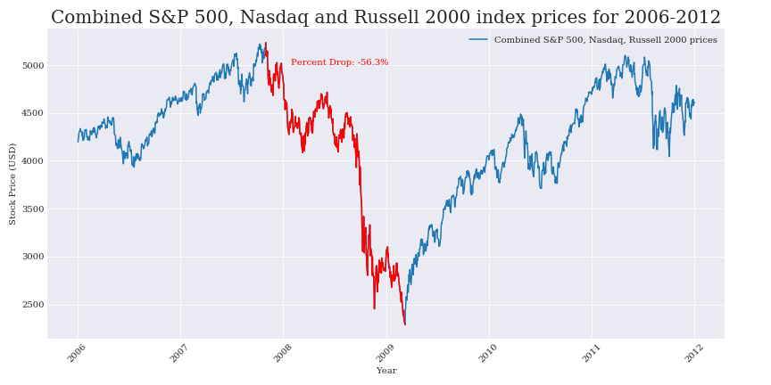
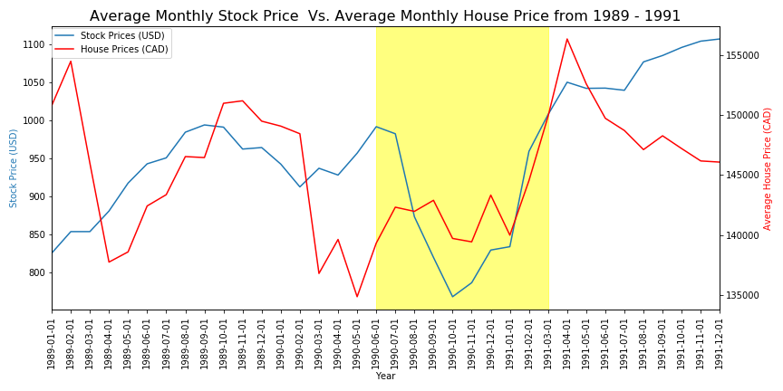
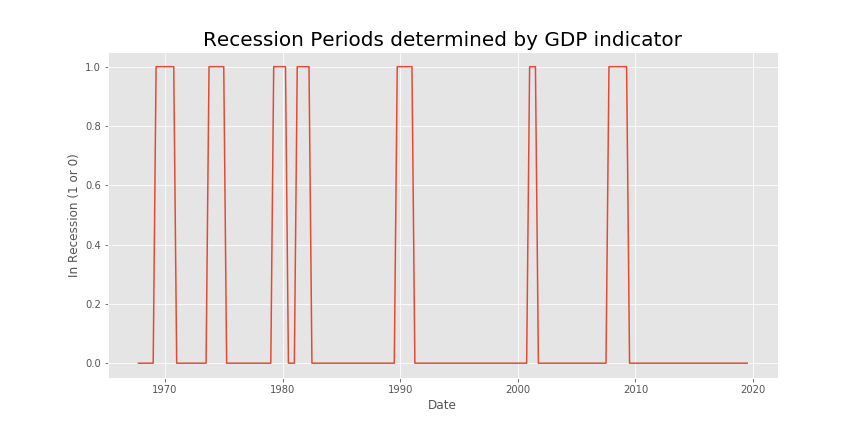
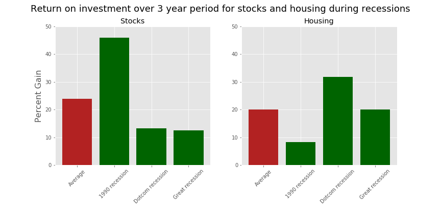

# Data Analytics Bootcamp Project 1

## Background

This project was completed early on in the bootcamp, and looking back there are so many things that could have done differently to produce more accurate results. Despite the hindsight is 2020, this was a great intro project to learn how to properly use pandas, python, and create some basic visualizations. This was a group project as well, and it was very exciting to learn and share the new experience of data analytics with other people!

A new trend of retail investors flooding the market has been evident especially through the market downturn during Coronavirus. This projects focus was to model two investing strategies during an economic downturn. The two strategies involve investing in the stock market with securities, or investing in the housing market. What brings the best return? 

### Data Retrieval

The first step of the process was to get as much data from the stock market and housing market to create a proper model for understanding return on investment during an economic downturn.

Stock Market Data

* The stock market data was retrieved from the yahoo finance API. To get a better representation of the market, data was retrieved for three major indices which cover small cap, mid cap, and large cap stocks. These three indexes were the Nasdaq, S&P 500, and Russell 2000

* The data periods retrieved were for 1989-1992, 1999-2005, and 2006-2011, which were chosen to represent three periods of economic downturn, including the stock data leading up to the downturn and after the downturn

* After collecting all the data, the combined price for all three indexes was taken and plotted to show general market trend during these periods

* Some pandas formatting of data had to be done to make the dataset compatible with the monthly housing data (stock data was daily)

Housing Data

* The housing data was collected from CREA which encompassed housing data from 1988 to present

* This data came unformatted in an excel spreadsheet and had to changed using pandas to properly display the values needed

* After collecting all the needed data we showed a couple visualiztions for our 3 time periods, with the housing data and stock market data overlayed

Defining Recession

* To determine our recession periods correctly we used the definition of a recession which is identified as two consecutive quarters of negative GDP growth. Although this is subjective, this was a good way to determine how to implement our investing strategy

* Using GDP metrics we were able to label periods of recession as either a 1 or 0.

* From the GDP indicator we determined the average length of a recession to be 14 months. Using this information we came up with an investment strategy of 
investing 10 months after the recession start date and keeping this investment in the market for a period of 3 years. This strategy was applied to both the stock and housing market to determine the best return on investment. 

### Conclusions

From our investigation of recession in conjunction with the housing and stock market, we determined a few trends:

* There is no strong correlation between the real estate market and recession. There is evidence of both upswings and downswings in the real estate market during recessions. The market definitely has an impact on housing prices, however it is clear that the real estate market is also heavily impacted by other factors

* It can be more effective to invest in the stock market during an economic downturn as compared to investing in real estate. The housing vs stock market chart shows that on average there is a higher return on investment from the stock market during a recession. Although the 1990 recession had a large impact on the average stock return and definitely increases the average percent gain from stocks, you have to take into account the fact that housing returns are impacted by other factors which diminish the value of housing investments such as realtor fees (sometimes 10%), mortgage interest fees, and tax on capital gains. This investment strategy also does not take into account other stock market investing strategies such as dollar cost averaging which can help reduce the risk involved with stock market investment, and produce an overall better investment

### Group members

This project was completed by [Rimsha Aziz](https://github.com/rimsha-aziz), [Michael Riina](https://github.com/MichaelRiina), [Andrew Maximos](https://github.com/NitrogenHamster?tab=overview&from=2020-06-01&to=2020-06-30), and myself!

