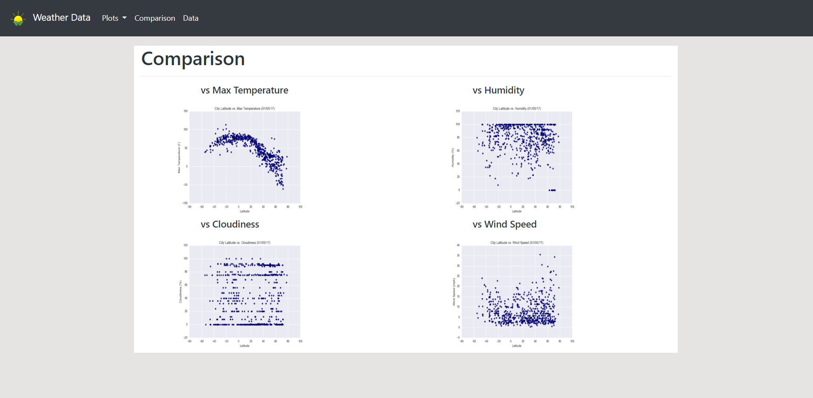

# Assignment 8 - Web Design Challenge

## Background

This week was a very brief intro to web technologies which was pretty cool! Although this was not the main focus of the course it was cool to understand how to build and design websites. Bootstrap makes it really easy!

Link to website - https://eric-pacheco95.github.io/weather-data-webpage/

### Website Requirements

The website consists of 7 total pages:

* A landing page containing:
 * An explanation of the project
 * Links to each visualizations page

* Four visualizations pages, each with:
 * A descriptive title and heading tag
 * The plot/visualization itself for the selected comparison
 * A paragraph describing the plot and its significance

* A comparisons page:
 * Contains all of the visualizations on the same page so we can easily visually compare them
 * Uses boostrap grid for the visualizations which fit on small, medium, and large screens

* A data page that:
 * Displays a responsive table containings the data used in the visualizations

The website also must include a navigation menu which allows easy access to each page

### Copyright

Trilogy Education Services © 2019. All Rights Reserved.
 
