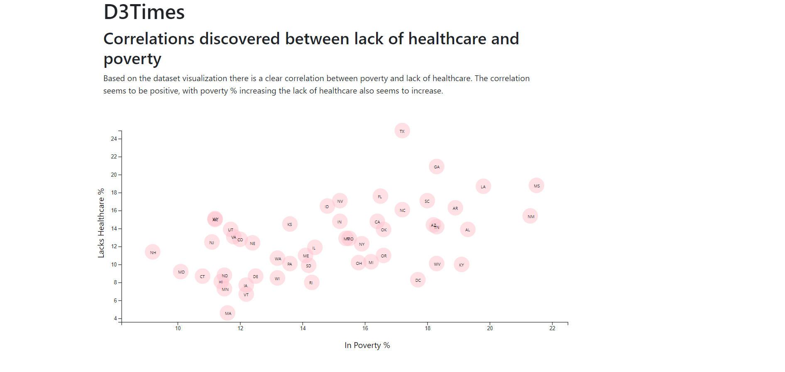

# Assignment 12 - D3 Challenge

## Background 

Making graphs without the help of other libraries was difficult task, and comforting to know I most likely won't have to make them from scratch again!

The dataset in this assignment is based on 2014 ACS 1-year estimates https://factfinder.census.gov/faces/nav/jsf/pages/searchresults.xhtml. The purpose of the assignment was to use D3 along with the dataset to provide a visualization for healthcare and poverty metrics.

### Copyright

Coding Boot Camp © 2018. All Rights Reserved.
