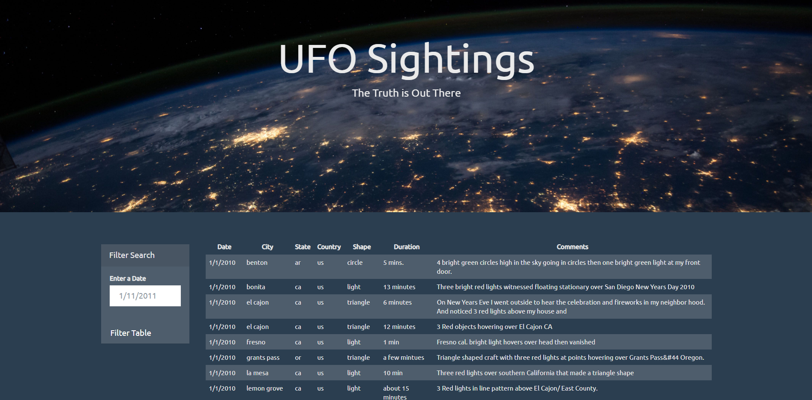

# Assignment 10 - Javascript Challenge

## Background 

Javascript was a challenge after being so content with python for a couple months. Javascript seemed very messy and at times unintuitive compared to pythons clean and simplistic syntax.
Despite these concerns I knew it was essential to properly learn and understand javascript because it is everywhere! After doing this homework and understanding the basics of event listeners and promises, I eventually came to appreciate the how cool it was to make a webapge interactive.

This project's objective was to create a web page containing a table of UFO sighting data which could filtered by data/time.

### Copyright

Trilogy Education Services © 2019. All Rights Reserved.
