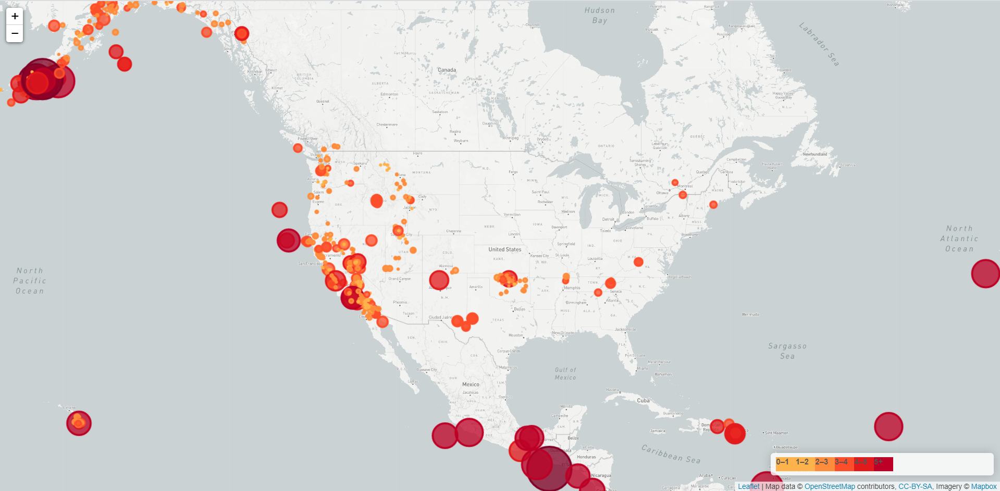

# Assignment 13 - Leaflet Challenge

## Background 

The leaflet library was really cool and the documentation is very easy to understand. The objective of this assignment was to plot earthquakes on a map using the data from https://earthquake.usgs.gov/earthquakes/feed/v1.0/geojson.php.

The data plotted was for the past 7 days. The map includes:

* data markers reflect the magnitude of the earthquake through size and color

* popups that provide additional information about the earthquake when clicked

* legend that provides context for map data

### Copyright

Trilogy Education Services © 2019. All Rights Reserved.
