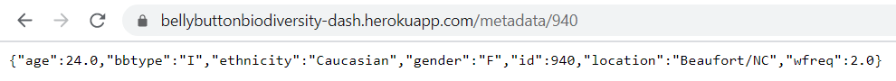
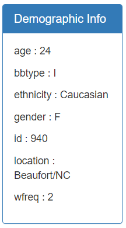
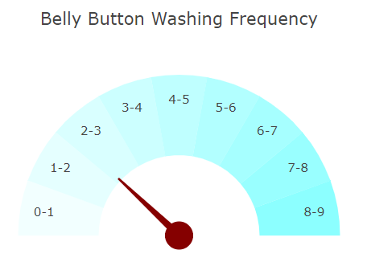
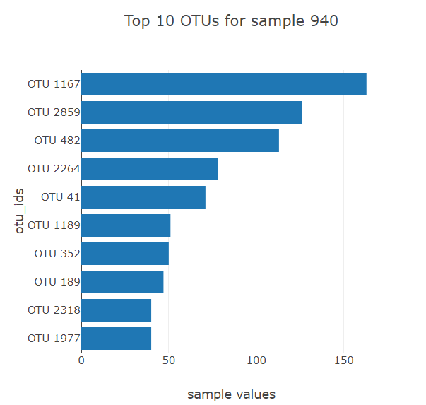
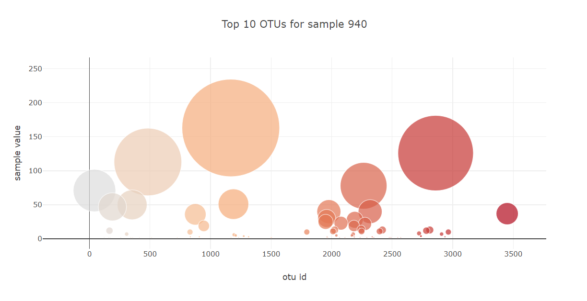
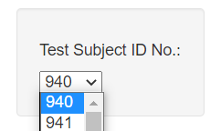

# Assignment 11 - Plotly

## Background

More javascript! This assignment's objective was to build an interactive dashboard which is hosted here - http://bellybuttonbiodiversity-dash.herokuapp.com/

### Step 1

The first step was create a flask app which will contain the dashboard html page, but also the flask app will be used to provide endpoints with data needed for the dashboard.

* The json data file was loaded in using the json module, which contained data for samples, names and metadata. Two pandas dataframes were created for samples and metadata respectively, and a standard python dictionary was created for the names

* Three flask endpoint routes were created for samples, metadata and names. The sample and metadata endpoints were created dynamically so that the app.js file could grab the metadata/sample data for a specific sample id.

### Step 2

The next step was to create multiple functions which could fill the metadata panel and gauge visualizations, build horizontal bar chart and bubble chart for top 10 OTUs for the selected sample, an option change function, and a dashboard initializer.

* The metadata panel function calls the metadata flask endpoint dynamically, searching for the metadata for a specific sample. This returned metadata is used to fill the metadata panel, and gauge visualizations

                            

* The chart builder function calls the samples flask endpoint dynamically, searching for the sample data for a specific sample. This returns all the OTU data for that sample which is then extracted for only the top 10 OTUs to display on the horizontal bar chart. The bubble chart encompasses the data for all OTUs within the selected sample

 

* The option change function listens on the dropdown menu for any changes to the sample, and if a change is present this function changes the data accordingly based on the sample by calling both the metadata panel function and chart builder function 

* The initialize dashboard function fills the dropdown menu using the names flask endpoint, and then fills the html page with a the visualizations for the first sample using the metadata panel function and chart builder function 

This app was then uploaded to heroku by filling the requirements.txt, runtime.txt, and procfile requirements

### Copyright

Coding Boot Camp © 2018. All Rights Reserved.
