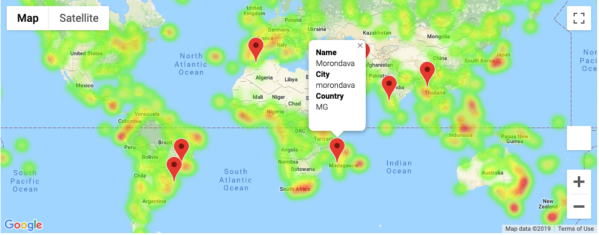

# Assignment 5 - Python API challenge

## Background

Using the Google Places and OpenWeatherMap apis was a great way to get a good understanding of how API interactions work.

### WeatherPy

In this challenge we were to create a python script to visualize the weather of 500+ cities across the world of varying location. The citipy and OpenWeatherMap APIs were used to create a series of visualizations with these relationships:

* Temperature (F) vs. Latitude
* Humidity (%) vs. Latitude 
* Cloudiness (%) vs. Latitude
* Wind Speed (mph) vs. Latitude

The next part was to run linear regression on each relationship, separating them into Northern and Southern Hemisphere and representing:

* Northern Hemisphere - Temperature (F) vs. Latitude
* Southern Hemisphere - Temperature (F) vs. Latitude
* Northern Hemisphere - Humidity (%) vs. Latitude
* Southern Hemisphere - Humidity (%) vs. Latitude
* Northern Hemisphere - Cloudiness (%) vs. Latitude
* Southern Hemisphere - Cloudiness (%) vs. Latitude
* Northern Hemisphere - Wind Speed (mph) vs. Latitude
* Southern Hemisphere - Wind Speed (mph) vs. Latitude

Each plot has an accompanying explanation of the relationship between each variable.

The final notebook had to include:

* Randomly select at least 500 unique (non-repeat) cities based on latitude and longitude.
* Perform a weather check on each of the cities using a series of successive API calls.
* Include a print log of each city as it's being processed with the city number and city name.
* Save a CSV of all retrieved data and a PNG image for each scatter plot.

### VacationPy

The Google Places API was then used in combination with the data from WeatherPy to display:

A heat map that displays the humidity for every city from WeatherPy

The dataframe was then filtered for locations with my ideal vacation weather conditions (Temperature between 15-25 degrees Celsius, wind speed less than 5 mph, and cloudiness % less than 15%)

Using Google Places the first hotel within 5000 meters of each location filtered by my ideal vacation weather was identified

A pin for each hotel with the Hotel Name, City, and Country info was placed on the heatmap

### Copyright

Trilogy Education Services © 2019. All Rights Reserved.

 
