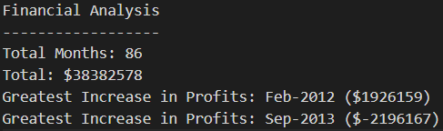
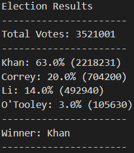

# Assignment 2 - Python Challenge

## Background

First dive into python programming! Learning the ins and outs of the python basics was a very fulfilling experience which definitely laid the groundwork for my passion for data science!

### PyBank

This challenge involved creating a python script for analyzing financial records in the budget_data.csv file. The python script that was created analyzed the records to calculate:

* The total number of months included in the dataset 

* The net total amount of "Profit/Losses" over the entire period

* The average of the changes in "Profit/Losses" over the entire period

* The greatest increase in profits (date and amount) over the entire period

* The greatest decrease in losses (date and amount) over the entire period

### PyPoll

This challenge involved helping a small, rural town modernize its vote-counting process. The poll data is stored in election_data.csv and the python script created calculated:

* The total number of votes cast

* A complete list of candidates who received votes

* The percentage of votes each candidate won

* The total number of votes each candidate won

* The winner of the election based on popular vote

### Copyright

Coding Boot Camp © 2018. All Rights Reserved.

